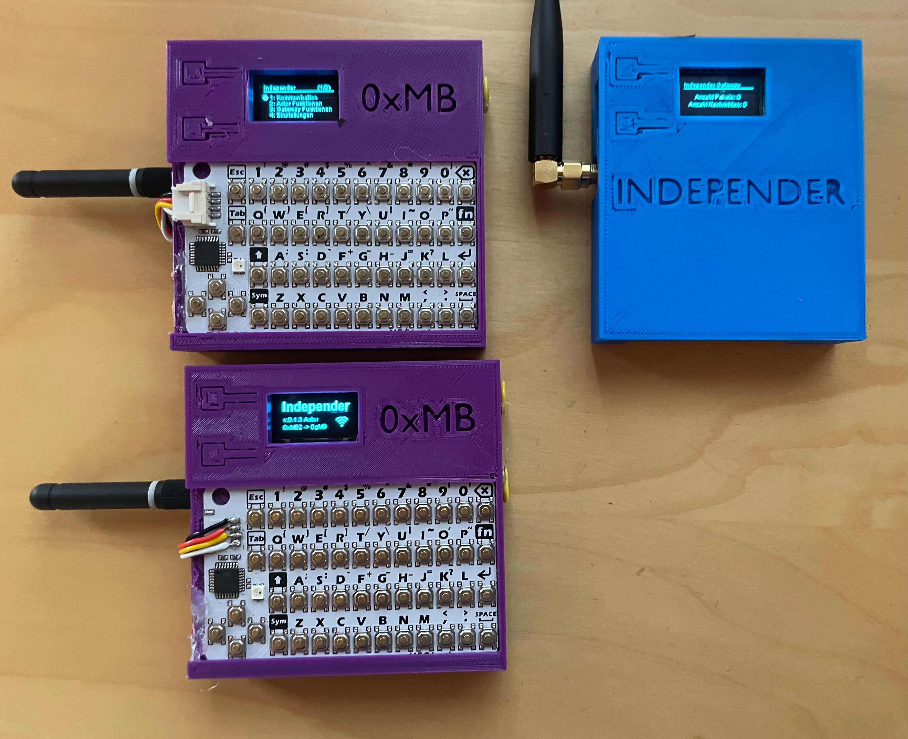
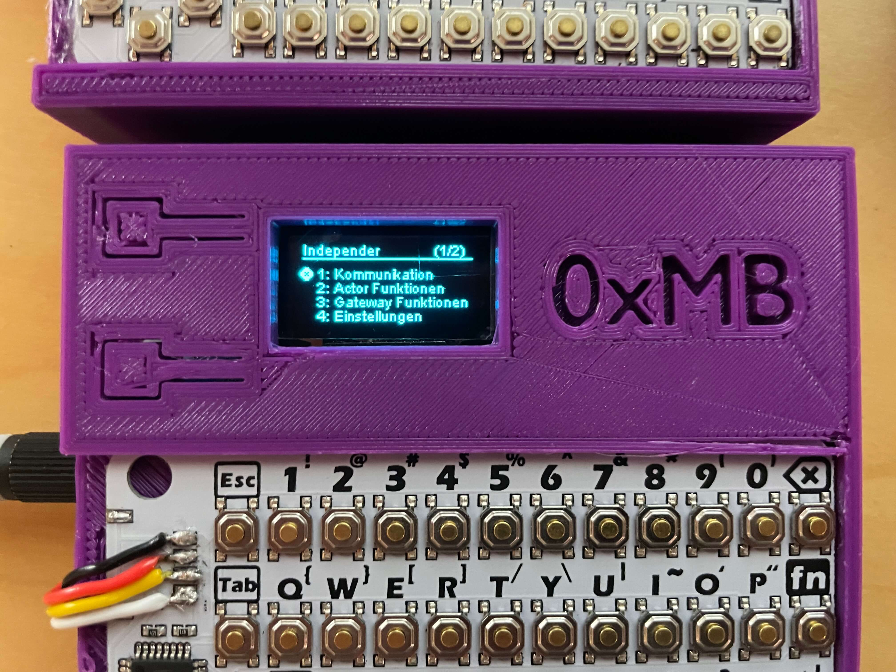

# Independer

This repository is about a device called **Independer**.

The goal is to develop a small **open-source communication gadget** (at the beginning we start with end-to-end encrypted messages) based on LoRa (thus **independent from normal infrastructures** like mobile radio or WIFI).

We use cheap *ESP32s*, *LoRa antennas*, *3D prototyping*, *small keyboards* and develop our own encrypted *protocol* together with *software*.

The project is still in its initial phase. If you want to **join, or have an idea**, feel free to [write me](mailto:maximilian@bundscherer-online.de) or [start a discussion](/discussions).

``esp32 - lora - encryption - short-message - protocol - keyboard``

Author: [Maximilian Bundscherer](https://bundscherer-online.de)

## Overview

This page describes the concept, the project structure, the encrypted LoraS transfer protocol (LoRaS) and the Independer application protocol. There are two type of devices: **Actor** (ID e.g. `0xMB` or `0x02`) with keyboard & accumulator and **Gateway** (ID e.g. `0gMB` or `0g02`) opt. with accumulator.

### Features

- **Actor to Actor (via LoRaS)** communcation: Send messages directly between two Actors.
- **Actor to Gateway (via LoRaS)** communcation: Send messages via a Gateway. Actors can query their messages via a gateway.
- **Actor to Actor (via WIFI/Internet)** communcation: Send messages via a Internet. Actors can query their messages via WIFI/Internet.
- ...

### Included

- Documentation
- Sourcecode (`src/`)
- 3D case (`case/`)

### Project stages

- [x] Antenna testing and 3D case prototyping
- [x] Crypt baseline implementations
- [x] Device (hardware, gui) baseline implementations
- [x] Gateway and Actor baseline implementations
- [ ] Complete docs
- [ ] 3D Case improvements
- [ ] Application level implementations
- [ ] Deploy (secret keys, actor and gateway releated) configurations
- [ ] Crypt improvements
- [ ] GUI Multilanguage
- [ ] ...

## LoRaS Protocol

This protocol is based on the **LoRa radio standard** and the transmission is currently **encrypted** with AES. The goal will be an **asymmetric protocol like GPG**. Attention has always been paid to **low overhead**, **transmission security** and **energy saving**. The three protocols in this section are for LoRa receive and transmit (non-application level).

Currently the frequency **868 MHz** is used, but in the future the frequency **433 MHz** will also be usable. The frequencies are currently designed for the German area, but **can be freely selected**. Possible legal restrictions, such as the specified duty cycle and transmit power, can be taken into account, for example, using the *Send quota* and *Send gain* settings.

`[from]` and `[to]` in this section are realated to hardware-IDs, not application IDs. 

\[P1\] and \[P3\] are not suitable for background processing on actors.

### Safe message \[P1\]

*Send message with hashcode-check*: Default protocol for e.g. Application messages.

`[num_packets]` and `[current_packet]` are int-values.

- `[from]:[to]:+:[num_packets]`
- `[from]:[to]:[current_packet]:[msg_part]`
- `[from]:[to]:-:[num_packets]`

### Unsafe short message \[P2\]

*Send short message without hashcode-check*: Default protocol for e.g. Who is in my area? or Is available?

Setting `[to]` to `*` addresses all devices in the environment.

- `[from]:[to]:s:[msg]`

### Unsafe single message \[P3\]

*Send single message without hashcode-check*: Testing protocol.

- `[from]:[to]:!:[msg]`

## Independer Protocol

Application level protocol is based on the LoRaS Protocol.

...

## More pictures

