## Antenna Measurements

### Overview

We tested three antennas:

- **Antenna 1** (ANT-868-CW-RCL-SMA) ([Mouser](https://www.mouser.de/ProductDetail/712-ANT-868-CWRCLSMA)) (≈ 9 €)
- **Antenna 2** (ANT-868-CW-RH-SMA) ([Mouser](https://www.mouser.de/ProductDetail/712-ANT-868-CW-RHSMA)) (≈ 10 €)
- **Antenna 3** LILYGO TTGO ESP32 (LoRa32 V2.1 1.6.1 Version LoRa ESP-32 OLED 0.96 Inch SD Card Bluetooth WiFi Module (868 MHz) ) ([Amazon](https://www.amazon.de/gp/product/B08T984WCT/)) (Antenna included in the package)

Two pieces of each antenna were measured to minimize or detect variations.

Reference Measurements (Open, Short and Load) below.

### Experiment

#### Antennas

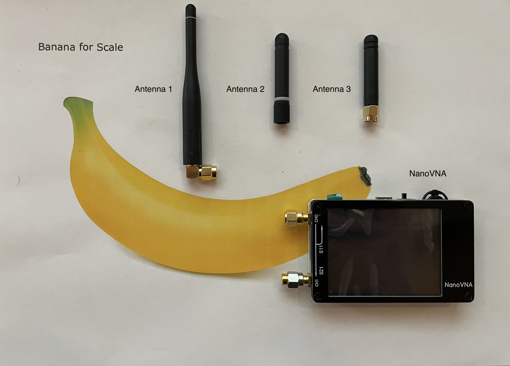

#### Connect to NanoVNA

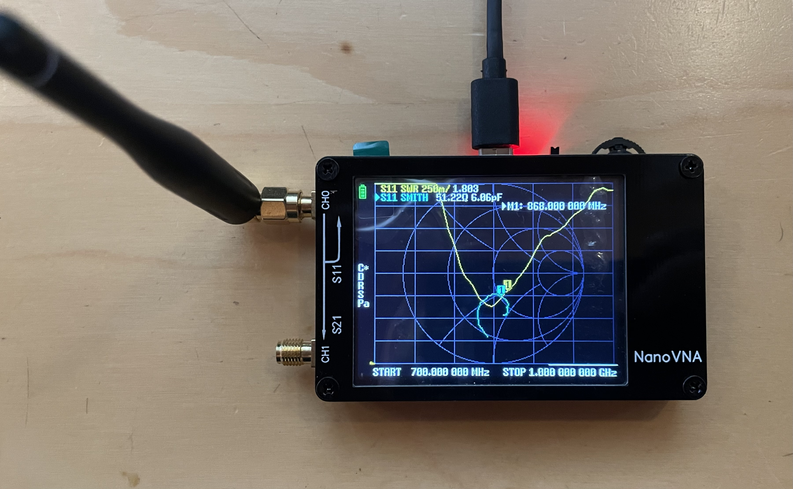

### Parameters

#### Calibration

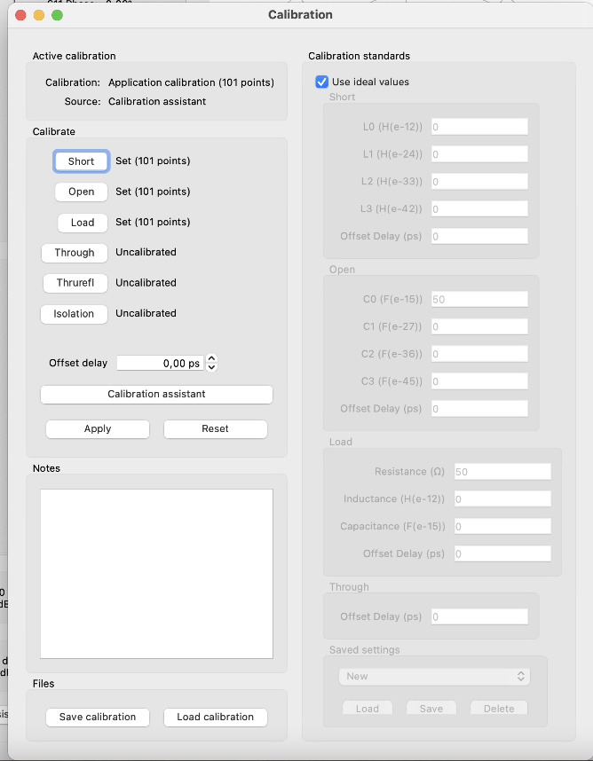

#### Sweep Configs

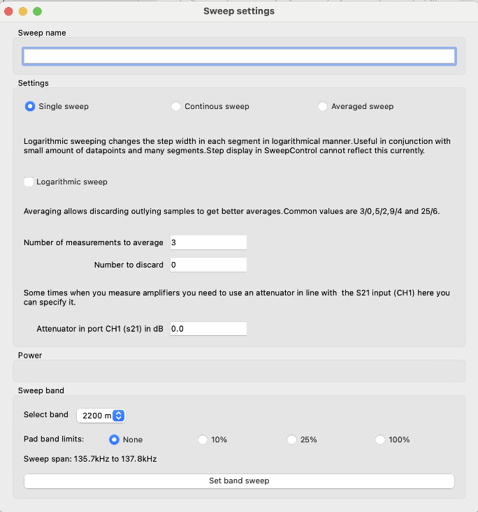
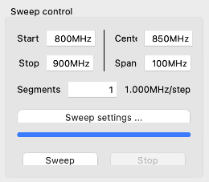

### Results

#### Antenna 1

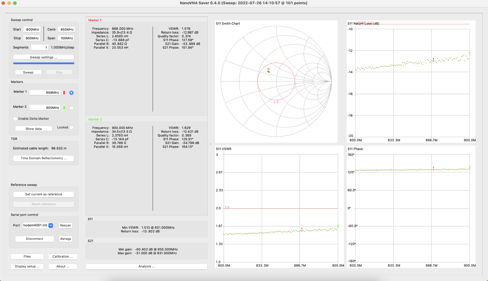
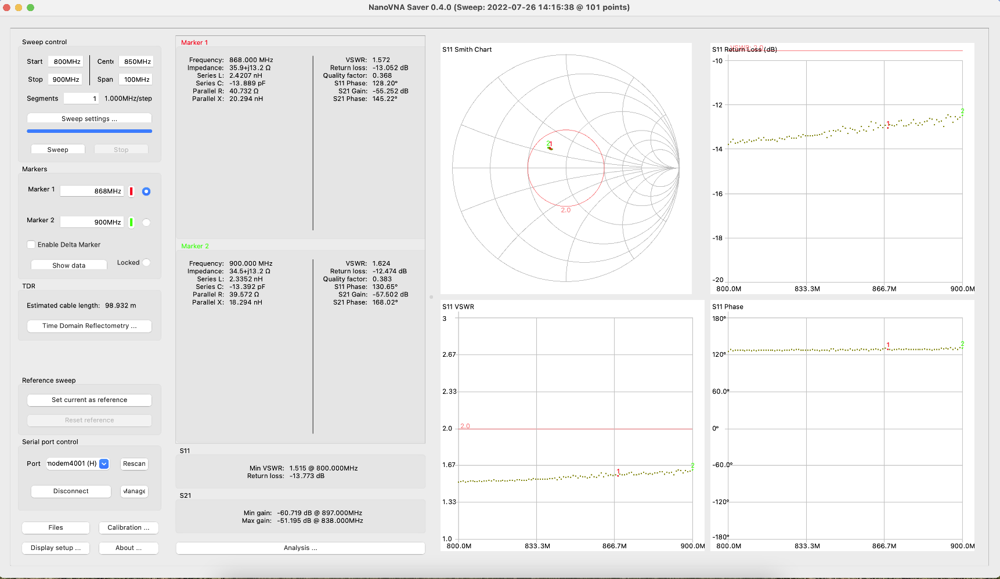

#### Antenna 2

#### Antenna 3

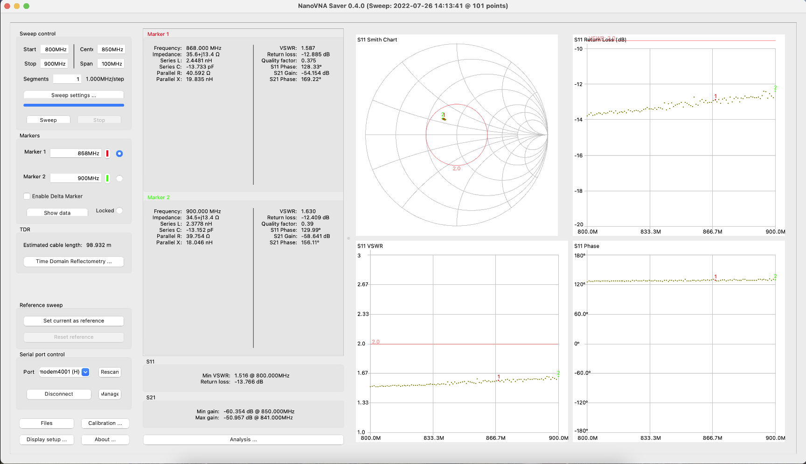
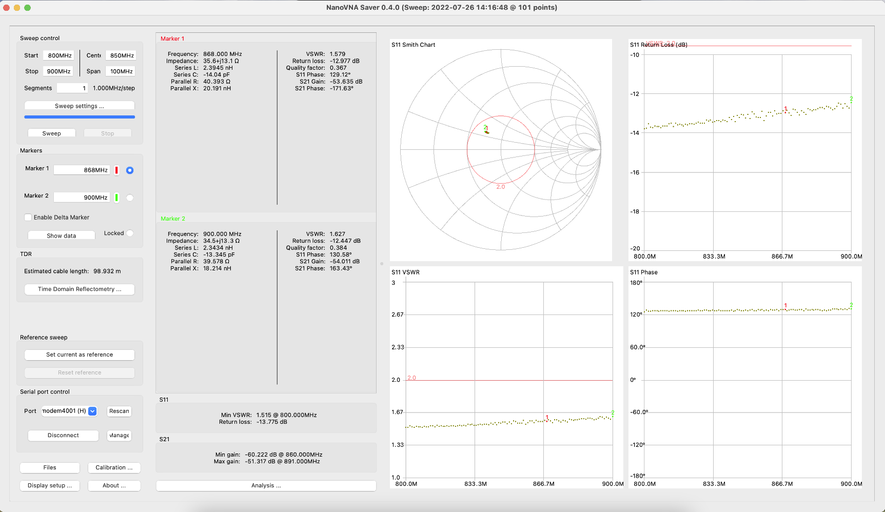

### Ref Measurements

#### Open

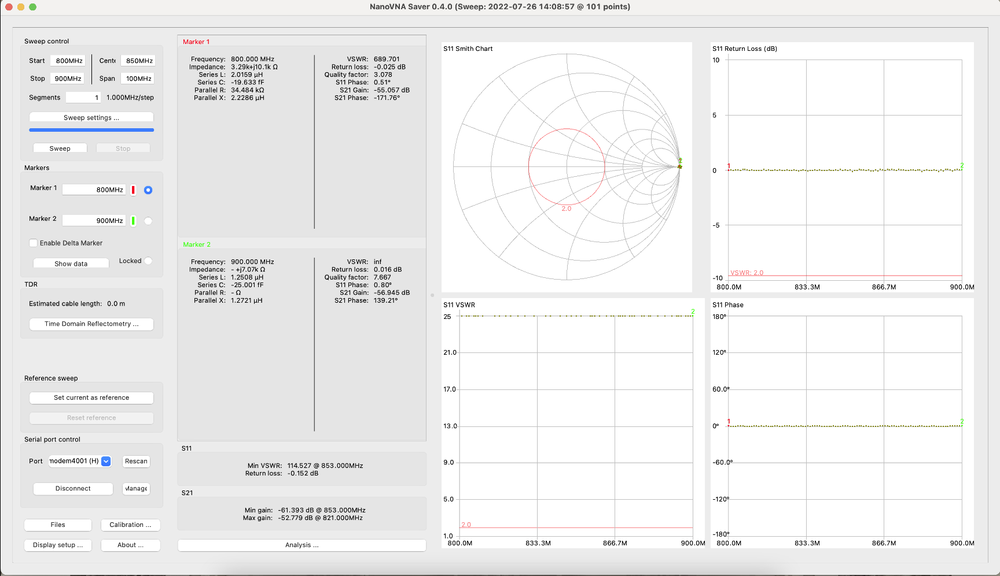

#### Short

#### Load

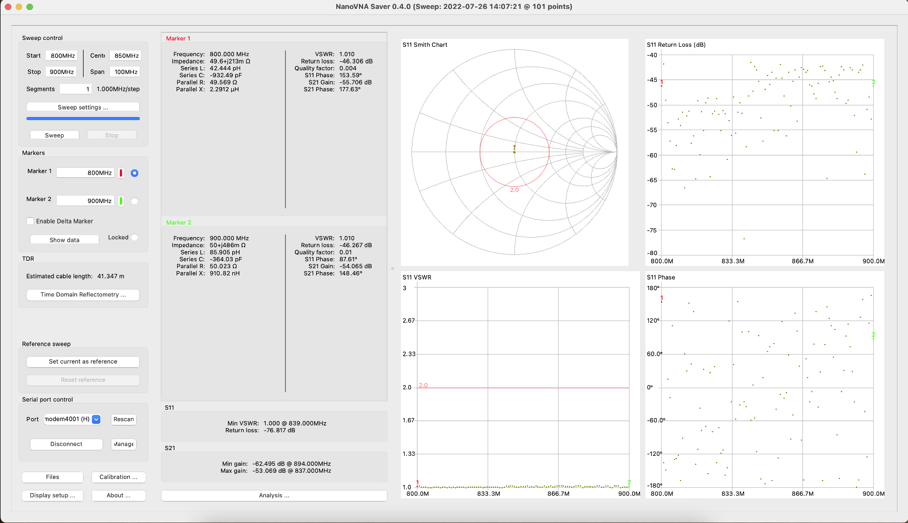
