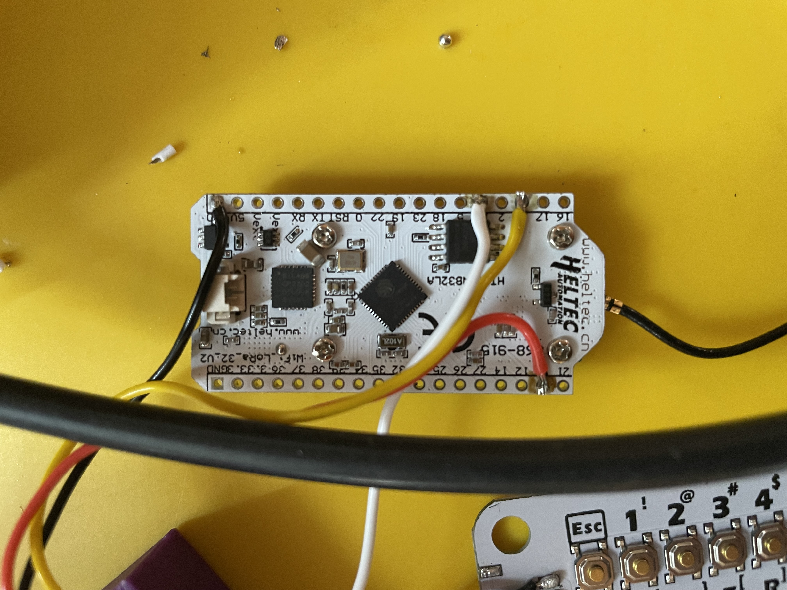
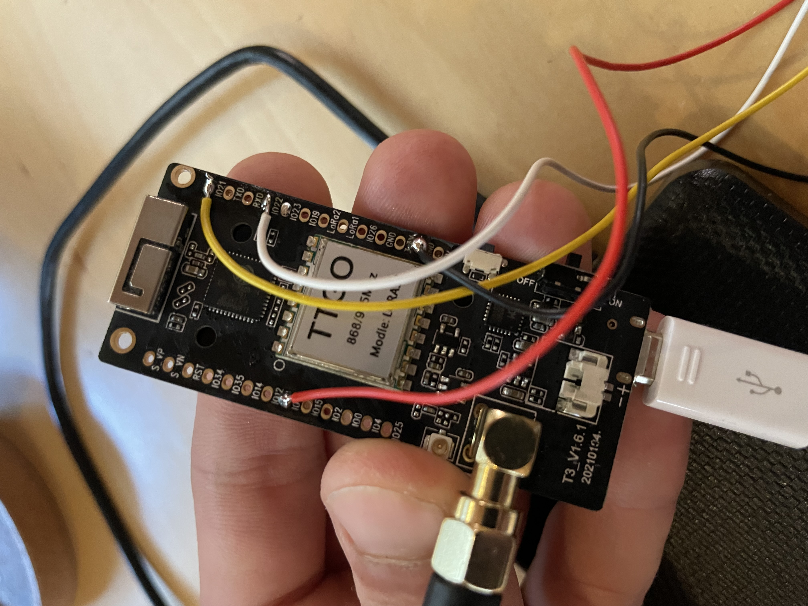

## Introduction

### How to build your own device

-  Read `Harware Overview` below.
- Print [3D-Case](../case/export).
- Connect antenna.
- (Opt. - on Actor) Connect the keyboard to the ESP32 board. Read `How to connect pins` below.
- (Opt. - on Actor) Connect the battery to the ESP32 board.
- Upload software to ESP32 board. Read `Build and upload (single device)` in [Developer Overview](../docs/developer.md). This is only necessary when initializing. After that, you can update via WIFI. See [Update-Doc](update.md).
- When setting up the device for the first time, a configuration wizard is started automatically.
- For some functions like online chat the Independer must be registered. Just write me a short mail and I will tell you the Independer ID and the Independer password.

### No Independer Registration

If the Independer is not registered, it will not run through the official Independer community.

This means that you can only communicate with other Independers if they do not participate in the official community. Also the connection to the Independer server for e.g. an update check or maintenance notes is not possible.

Unfortunately, this is technically necessary at the moment to ensure that, for example, no ID has been assigned twice in the official community.

Technically, unregistered Independers use a different sync word in LoRa connections.  This means that they can only be heard by other unregistered Independents.

## Hardware

### Overview

- Heltec ESP32 WiFi/LoRa v2 with OLED-Screen (SX1276 V2, 868-915MHz) ([Amazon](https://www.amazon.de/-/en/gp/product/B078M74NNN/)) (≈ 25 €)
- (alternative) LILYGO TTGO ESP32 (LoRa32 V2.1 1.6.1 Version LoRa ESP-32 OLED 0.96 Inch SD Card Bluetooth WiFi Module (868 MHz) ) ([Amazon](https://www.amazon.de/gp/product/B08T984WCT/)) (≈ 27 €)
- CardKB (U035, MEGA328P, M5Stack) ([Distrelec](https://www.distrelec.de/de/cardkb-mini-tastatureinheit-mega328p-m5stack-u035/p/30172534)) (≈ 7 €)
- Antenna Adapter (CAB.616) ([Mouser](https://www.mouser.de/ProductDetail/960-CAB.616)) (≈ 4 €)
- Antenna 1 (ANT-868-CW-RCL-SMA) ([Mouser](https://www.mouser.de/ProductDetail/712-ANT-868-CWRCLSMA)) (≈ 9 €)
- (opt.) Antenna 2 (ANT-868-CW-RH-SMA) ([Mouser](https://www.mouser.de/ProductDetail/712-ANT-868-CW-RHSMA)) (≈ 10 €)
- (opt.) LiPo Battery (Seamuing 3.7V 3000mAh) ([Amazon](https://www.amazon.de/gp/product/B08V11Z88Q/))
(≈ 10 €)

In total ≈ 45 - 55 € per device (without shipping).

## How to connect pins

### Heltec Board

### TTGO Board

### Keyboard

